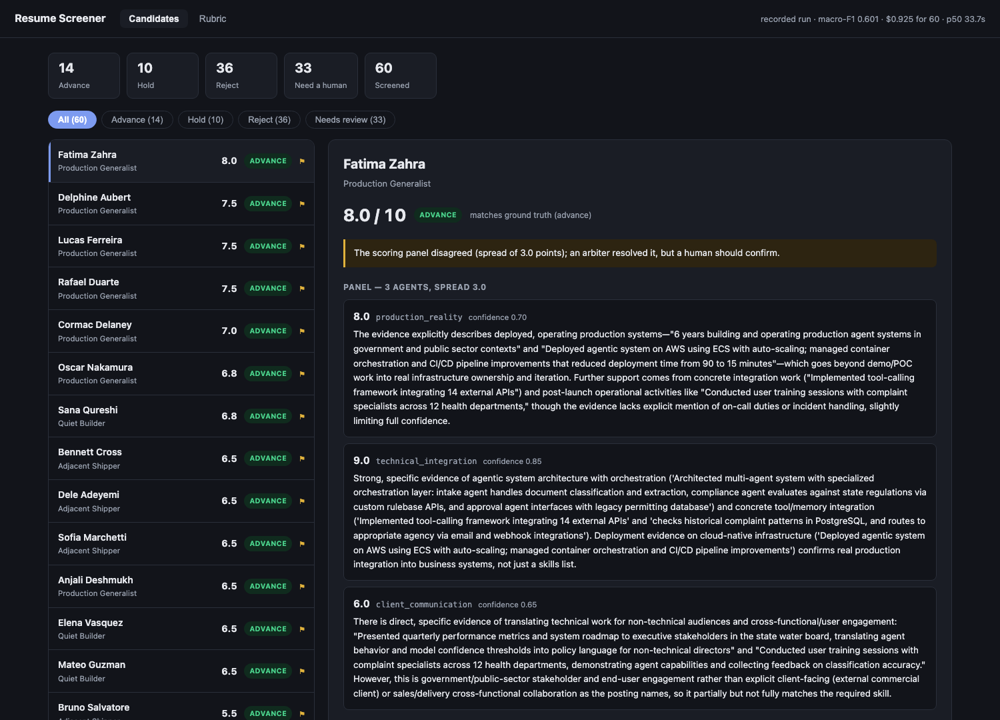

# Resume Screener

An agent that reads a stack of resumes against a specific job posting, ranks them, and tells you which ones a human should look at first.

Built for the problem of a talent team reading every resume by hand with no ATS. It is not a filter that rejects people quietly. Every verdict comes with the evidence behind it, and anything the system isn't confident about gets handed back to a person rather than decided.

## TL;DR

- **What it does.** Writes scoring criteria from a job posting, scores each resume against them with a quoted rationale per dimension, and asks a second model for another look when the call is close.
- **How well.** **macro-F1 0.88–0.92** on 60 labelled synthetic resumes, **~$0.28 per 60** (~0.5¢ each), p50 8.4s, ~16% sent to a human. Quoted as a *range* because identical runs span 0.051.
- **The honest part.** The cutoffs that turn a score into a verdict were fitted on the same corpus they're scored against. Errors run one direction — below the label. The corpus is synthetic. There is no bias audit. All of it is written down in [LIMITATIONS.md](docs/LIMITATIONS.md).
- **It replaced its own architecture.** It ran as three parallel agents plus an arbiter. Measured, the parallel panel scored *worse* than a single call (0.788 vs 0.821) while costing twice the API calls; the arbiter was the part earning its keep. Now it is one scoring call plus a conditional arbiter: **0.899**, half the calls, 26% faster. [Working](docs/RESULTS_HISTORY.md)
- **Latest finding.** Give a cheaper model cutoffs fitted to its own scale and the model ranking reverses: GPT-5.6 Luna held out at **0.861** against Sonnet's **0.787** on the full corpus, at **a third of the cost** — after looking 0.26 *worse* under the shipped cutoffs. A fixed score threshold is part of the harness, not the model. [CUTOFF_FIT.md](docs/CUTOFF_FIT.md)
- **The most useful thing here** is not the score. It's the measurement discipline: the noise floor is measured, the metric choice is justified, and three of the biggest findings were corrections to earlier findings.
- **Try it:** `uvicorn resume_screener.adapters.api:app --reload`, password `marco1`. Opens on a recorded run and costs nothing until you submit a posting.

### How it actually works, in 60 seconds

You paste a job posting. An **Opus** agent reads it and writes three
scoring dimensions, each with a brief for the agent that will own it —
so the criteria come from *your* posting, not a generic checklist.

Then, per resume:

1. **A Haiku agent pulls out quoted evidence.** Not a summary — verbatim
   lines from the file. Everything downstream scores those quotes, so no
   verdict can be based on an impression the resume never supported.
2. **One call scores all three dimensions** against that evidence, with a
   quoted rationale for each. This used to be three parallel agents that
   never saw each other, until measurement showed the parallel version
   was *worse* than one call and cost twice as many API calls.
3. **A second agent takes another look — but only when it could change
   the answer.** If the score lands within 0.5 of a verdict boundary, an
   arbiter re-reads the three rationales and returns its own score.
   Otherwise it is not called: it moves a score by 0.33 on average, so
   further out it cannot cross a line.
4. **A human is asked only for genuinely borderline calls** — where the
   final score sits close enough to a cutoff that a small difference in
   judgment flips the answer. ~15% of the stack, down from 53%.

The final score is the mean of the three dimensions, and one function
turns it into `advance` / `hold` / `reject`. The arbiter never returns a
verdict, only a score — otherwise the same 6.5 could mean two different
things depending on whether the panel happened to split.

**The thresholds belong to the model, not the pipeline.** Different models
grade on different scales, so each gets cutoffs fitted to its own
distribution. Skipping that made a good model look 0.26 worse than it was.

Full detail in [docs/ARCHITECTURE.md](docs/ARCHITECTURE.md).

**In a hurry?** [`docs/overview/index.html`](docs/overview/index.html) is a
single self-contained page with the headline results, the noise band, the
calibration finding, and the four things this project does *not* prove.
Open it locally, or serve it with GitHub Pages.

### Where to read next

| If you want | Read |
|---|---|
| What the numbers are worth | [LIMITATIONS.md](docs/LIMITATIONS.md) |
| Whether the name changes the score | [BIAS_AUDIT.md](docs/BIAS_AUDIT.md) |
| Why macro-F1, and what it hides | [METRIC_CHOICE.md](docs/METRIC_CHOICE.md) |
| How noisy the system is | [VARIANCE.md](docs/VARIANCE.md) |
| Every measured run, and what changed before it | [RESULTS_HISTORY.md](docs/RESULTS_HISTORY.md) |
| Which model to use, and the calibration trap | [BAKEOFF.md](docs/BAKEOFF.md) · [CUTOFF_FIT.md](docs/CUTOFF_FIT.md) |
| Whether the 4-agent cascade is worth it | [RESULTS_HISTORY.md](docs/RESULTS_HISTORY.md) |
| Where the money goes | [COST_ANALYSIS.md](docs/COST_ANALYSIS.md) |
| Why one agent scores everyone low | [SCORE_SCALE.md](docs/SCORE_SCALE.md) |
| How the cutoffs were chosen | [CUTOFF_SWEEP.md](docs/CUTOFF_SWEEP.md) |
| When it escalates to the arbiter | [ESCALATION_SWEEP.md](docs/ESCALATION_SWEEP.md) |
| How the test corpus was built | [corpus_design.md](docs/corpus_design.md) |
| Per-candidate scores and reasoning | [CANDIDATE_REPORTS.md](docs/CANDIDATE_REPORTS.md) |
| The full results of the latest run | [EVAL_RESULTS.md](docs/EVAL_RESULTS.md) |
| How the system is built, and why | [ARCHITECTURE.md](docs/ARCHITECTURE.md) |
| Deploying it without an unbounded bill | [HOSTING.md](docs/HOSTING.md) |
| Project status and open decisions | [PLAN.md](PLAN.md) · [STRUCTURE.md](STRUCTURE.md) |



Submit a posting, and the whole flow runs top to bottom:

1. **Paste a job posting.** Any posting, not just this one.
2. **It writes three scoring criteria from that posting**, each with the brief for the agent that owns it.
3. **Resumes get screened against those criteria**, ranked, with the reasoning behind every score.

The screenshot shows 60 test resumes screened for roughly **$0.28 total**, about half a cent each. 18 advance, 15 hold, 27 reject, and **29 flagged for a human**.

```bash
uvicorn resume_screener.adapters.api:app --reload
```

The page opens on the bundled posting and a run that already happened, so there is something real to look at before spending anything. Submit a different posting and it does a live run over a 12-resume sample, about $0.19 and under a minute, with a progress bar. Identical postings are served from cache rather than re-billed, and **Criteria only** writes the criteria without screening, for a few cents.

### Reasoning you can check

Each agent's verdict shows as **two bullets, no more**, and every quote it relied on is traced back to the section of the resume it came from. The section chips are clickable: they open that candidate's resume and highlight the exact line.

The first question anyone asks about AI-written feedback is whether it actually read this resume or is producing plausible boilerplate. A citation that resolves to `§ Experience` and jumps to the sentence answers that in one click. A quote the system cannot find verbatim in the resume gets **no citation at all**, rather than a confident-looking label — an unlocatable quote means the model paraphrased, and dressing that up would defeat the point. Across the recorded run that leaves 100% of candidates with at least one grounded citation and about 6 highlighted lines each.

## Where this stands

**Working:** the cascade, rubrics generated from any posting, an MCP server (5 tools), a CLI (3 commands), a web app that runs the whole flow, resume upload for PDF/Word/Markdown/text, and a 60-resume labelled evaluation. 249 tests, all offline.

**Measured:** macro-F1 **0.88–0.92** across three runs of 60 labelled resumes, ~0.5 cents each. Up from 0.601 — the cutoffs were swept rather than guessed, the model was recalibrated to its own scale, and the parallel panel was replaced by one call. Quoted as a range because identical runs span 0.051; see [docs/VARIANCE.md](docs/VARIANCE.md).

**Remaining weakness:** all 9 surviving errors still run one direction, the model scoring below the label. `production_light_ai` — strong production history, shallow AI depth — is 1 of 7.

**Not built:** hosting, a guided walkthrough, and two of the three arms of the architecture comparison. All tracked in [PLAN.md §9–§11](PLAN.md). What this system cannot do, and where it should not be trusted, is in [docs/LIMITATIONS.md](docs/LIMITATIONS.md); where the money goes is in [docs/COST_ANALYSIS.md](docs/COST_ANALYSIS.md).

## How it works

Two stages per resume, plus a third on about a quarter of them.

```
  Resume
    │
    ▼
  Extract        cheap model pulls out quoted evidence
    │
    ▼
  Score          ONE call, all three dimensions
    │            8.0        9.0        6.0
    │
    ▼
  Is the mean near a verdict cutoff?
    │
    ├── no  ──▶  take it                       (~75% of candidates)
    │
    └── yes ──▶  arbiter re-reads the           (~25% of candidates)
                 rationales and rules
                          │
                          ▼
                advance · hold · reject
```

The arbiter is gated on **distance to a cutoff**, not on disagreement. It moves a score by 0.33 on average and never more than 1.5, so a score sitting further out than that is one it cannot change — and 92% of the calls under the old disagreement trigger changed nothing.

### Why three dimensions

The count came from the posting, not from an experiment. This job description has three distinct requirement clusters:

| Dimension | What it judges |
|---|---|
| `production_reality` | Shipped and running, or a demo that stopped at the prototype? The posting says "not demos or prototypes" three separate times. |
| `technical_integration` | Real agentic work with memory, tools, and orchestration, or a skills list? |
| `client_communication` | Evidence of explaining technical work to non-technical people. |

`core/rubric_gen.py` rejects any rubric that isn't exactly three.

**Honest caveat:** the count was never tested. Two versus three versus five is still open in [PLAN.md §8](PLAN.md).

### Try it on your own resume

**Upload a resume** takes a PDF, Word document, Markdown or text file, screens it against whatever posting is in the box, and ranks it alongside the corpus.

Nothing is kept. The file is written to a temp directory, read, and deleted in a `finally`; a test asserts the directory is gone afterwards. It is somebody's actual resume, and storing a copy on a demo server is not the demo's call to make.

It also gets no ground-truth label. `expected` stays null rather than guessed, because scoring a real person against a synthetic answer key would report a fictional accuracy.

## The rubric is written from the posting, not hardcoded

Hand a job posting in and the system writes its own scoring standard first: three dimensions, each with the criteria the panel scores against and the brief for the agent that owns it.

This matters because a panel is only as good as what it was told to look for. A generic "AI engineer" checklist scores every posting identically. A rubric derived from *this* posting notices what this posting actually repeats.

To check it wasn't just pattern-matching to engineering roles, I ran it against a charge-nurse posting for a hospital emergency department. It produced dimensions on ACLS/PALS/TNCC certification, charge authority on an unsupervised night shift, and Joint Commission documentation compliance. Nothing leaked through from the engineering version. It also picked up the posting's "we are not looking for" section and treated outpatient-only experience as a negative signal rather than a neutral one.

Two rules are enforced in code rather than trusted to the model:

- **Exactly three dimensions**, for the reason above.
- **Generation failure raises.** There is no silent fallback to the built-in rubric. Scoring one job's candidates against a different job's criteria is a wrong answer that looks like a right one.

### What keeps the demo honest

A run against any posting other than the bundled one **reports no accuracy figure at all**. The labels in `data/labels.json` describe exactly one job. Screening these same resumes against a payments or nursing posting produces perfectly correct verdicts that those labels say nothing about, and grading them against the wrong answer key would publish a made-up number as if it meant something.

Expect most candidates to score near zero there. The corpus is 60 AI-engineer resumes, and rejecting them for a payments role is the system working, not failing.

A live run is capped at 24 resumes. That is a spending limit, not a technical one.

## Why MCP

A talent team with no ATS shouldn't have to adopt a new app. They should be able to ask the AI client they already have.

So this is an MCP server first. In Claude Desktop there is nothing to install and no UI to learn: paste the posting into the chat, ask it to rank a folder. The web page exists to look at results, not as the product.

Five tools, one per action: `preview_rubric`, `screen_resume`, `rank_pool`, `explain_verdict`, `query_candidates`.

**None of them takes a real-world action.** They read and report. Nothing can reject a candidate, send mail, or write to a system of record. That keeps a human on every hiring decision, and it means a prompt injection that survives out of a resume still has nothing to actuate.

`preview_rubric` returns a `rubric_id` that `rank_pool` accepts, so the rubric a person reads and approves is the one that scores the pool. Generation isn't deterministic, which is exactly why that id exists.

## Results, and what they're worth

Measured on 60 labeled synthetic resumes ([full results](docs/EVAL_RESULTS.md), [every candidate's reasoning](docs/CANDIDATE_REPORTS.md)):

| Metric | Value |
|---|---|
| Macro-F1 ([why this metric](docs/METRIC_CHOICE.md)) | **0.88–0.92** (3 runs) |
| Accuracy | 0.88–0.92 |
| Cost | ~$0.28 for 60 (~0.5c each) |
| Latency | p50 8.4s |
| Flagged for a human | 9 / 60 (was 32) |

**The number that matters more than the headline: run the same configuration four times, unchanged, and macro-F1 spans 0.051.** 9 of 51 candidates change verdict at least once, and all 9 sit within 1.0 of a score cutoff. So the headline is one draw from a wide distribution, not a fixed property — which is why it is quoted as a range, and why any comparison below that turns on less than 0.051 is unresolved rather than decided. Measured over four runs in [docs/VARIANCE.md](docs/VARIANCE.md).

**One word that trips people up: "parse failure" is *our* code failing to read the *model's* answer** — not the model failing to read a resume. Each scoring agent is asked to reply with JSON. When that reply is missing the field we need, the score is discarded and the candidate is flagged for a human. Sonnet fails this way on 1–4% of calls; an all-Haiku panel failed on 43%. See [docs/BAKEOFF.md](docs/BAKEOFF.md).

**Where it actually fails:** `hold` is still the weakest class at 0.65 recall, against 0.90 for `advance` and 1.00 for `reject`. Identifying the middle is harder than separating the ends, and it stayed the hardest even after the fix that tripled it.

### Where it still fails

| Archetype | Correct |
|---|---|
| `academic_researcher` `early_career` `keyword_stuffer` `production_generalist` `quiet_builder` `wrong_domain` | **100%** |
| `demo_specialist` | 6/7 |
| `adjacent_shipper` | 4/6 |
| `production_light_ai` | **1/7** |

Six of nine archetypes are perfect. Two archetypes account for 8 of the 9 remaining errors, and both describe the same profile: real production experience with shallow AI depth. That is the judgment call this rubric still gets wrong.

**Every one of those 9 errors runs the same direction** — the model scoring below the label, never above. That bias shrank a lot when the cutoffs were fixed, but it has not gone away.

The 60 resumes come from nine **archetypes**: candidate types with a target verdict and a target level per dimension, assigned at generation time. That is where ground-truth labels come from, and it is what makes a failure legible — without it, "macro-F1 0.847" would tell you nothing about *which* candidates it cannot judge. [docs/corpus_design.md](docs/corpus_design.md) has the specs.

### The cutoffs were the bug

`scripts/sweep_cutoffs.py` re-thresholds recorded scores — no API calls, free ([output](docs/CUTOFF_SWEEP.md)). It found the score-to-verdict mapping was discarding most of the signal.

| Label | lowest score | median | highest |
|---|---|---|---|
| advance | **4.0** | 6.5 | 8.0 |
| hold | 0.0 | 2.5 | **4.5** |
| reject | 0.0 | 0.3 | **1.0** |

Every `advance` scored ≥ 4.0. Every `reject` scored ≤ 1.0. The panel was ranking candidates correctly the whole time; the hand-picked 7.0/5.0 bar was rejecting most of the people it was meant to advance.

Moving to **4.0/1.0** took macro-F1 from 0.601 to **0.847**, with `hold` recall going 0.20 → 0.65. The sweep predicted 0.846; the run measured 0.847.

**Escalation and human review were later unwelded** — that turned out to matter more than either. Escalating used to auto-flag a candidate for a human, so ~half the stack landed in a queue. But panel disagreement barely predicts a wrong answer: the old flag queued 53% of candidates and caught 36% of errors, while a *near-cutoff* flag at the same queue size catches 82%. And the arbiter itself was mostly ceremony — it moves a score by 0.33 on average, so **92% of escalations returned a different number and the same verdict**. Now the arbiter fires only when the panel mean sits within 0.5 of a cutoff, and a human is asked only when the *final* score sits within 0.4 of one. Measured live: escalation fell **47% → 5%**, the human queue **53% → 30%**, macro-F1 unchanged. The review margin is a fraction of each model's own score band, not a fixed number of points — a flat margin queued 43% of Sonnet's stack and 15% of Luna's, because they grade on different scales. [docs/RESULTS_HISTORY.md](docs/RESULTS_HISTORY.md)

Two things landed with it. The arbiter now returns a **score only** — previously an escalated 6.5 could be `advance` because the arbiter said so while an unescalated 6.5 was `hold`, the same score getting different answers depending on a coin flip. And escalation now requires the agents to disagree on the *verdict*, not merely to vary: a 9.0/7.0/6.0 panel has a wide spread but nothing an arbiter returns changes the outcome.

Caveat worth keeping: those cutoffs were fitted on the same 60 resumes they are scored against. The plateau is narrow on the advance side, so treat 4.0/1.0 as informed rather than validated until the corpus grows.

Other things named rather than hidden:

- The three-way architecture bake-off in [PLAN.md §8](PLAN.md) is unfinished. Only this design has been measured, so "the cascade beats one big call" is asserted, not shown.
- **A third of the stack still reaches a human, and half the errors still get through.** The system is wrong on ~13% of candidates and a reviewer sees ~30%; reviewing a third of a stack cannot catch most of the mistakes in it. That is arithmetic, not a tuning failure — raising the review margin trades queue size for recall roughly linearly, and cannot reach high recall at any tolerable queue size.
- Disagreement-based escalation can't catch a panel that is unanimously and confidently wrong, because there is no disagreement to detect. That and the rest of the failure modes are in [docs/LIMITATIONS.md](docs/LIMITATIONS.md).
- Roughly 1 panel call in 180 still loses its score to malformed JSON. Those get flagged for review, never silently scored zero. [PLAN.md §3b](PLAN.md) has the two parsing bugs that only appeared once this ran against the real API, including one that was fabricating confident zeros and not flagging them.

Every measured run, what changed before it, and why the number moved is tracked in [docs/RESULTS_HISTORY.md](docs/RESULTS_HISTORY.md).

### Why scores run low: one agent, and a decision that was tested

Of the three panel agents, `client_communication` scores a mean of **1.00**, versus 7.55 and 6.39 for the other two on candidates the corpus labels `advance`. It rarely exceeds 4.0 for anyone. The reason: most resumes never document client-facing work, and this persona reads that silence close to disqualifying rather than neutral — so it drags nearly every composite down about two points. That is why a 7.0 cutoff was far too high, why the arbiter kept overriding it upward, and why all remaining errors run the same direction.

**This was fixed and measured, then reverted.** A version telling the agent that silence scores mid-scale, not near-zero, was built and run against the full corpus. It worked on the agent's own terms — mean 1.00 → 3.34, 35 zeros → zero — but corpus accuracy fell, each version at its *own* best cutoffs: **0.880 → 0.796 macro-F1**. Kept the stricter version for accuracy.

The honest caveat: the synthetic archetypes were generated with an intended `client_communication` level, so a harsh reading of silence correlates with the answer key on *this* corpus specifically. On a real applicant, the fairer version is probably the better judge — this comparison only says which one matches synthetic labels better. Full numbers in [docs/SCORE_SCALE.md](docs/SCORE_SCALE.md).

The design decisions and their tradeoffs are in [PLAN.md](PLAN.md), including what's deliberately unfinished and why.

## Quickstart

Python 3.11+.

```bash
git clone https://github.com/kjb135-coe/resume-screener.git
cd resume-screener
python3 -m venv .venv && source .venv/bin/activate
pip install -e ".[dev]"
```

The test suite is offline. It never calls an API, needs no key, and costs nothing:

```bash
pytest
```

Look at the recorded run in a browser. No API key needed, since it reads results from disk:

```bash
uvicorn resume_screener.adapters.api:app --reload
```

Everything past this point calls the Anthropic API and costs money:

```bash
cp .env.example .env    # then put your key in it
```

Write a rubric for any posting (one call, a few cents):

```bash
resume-screener rubric docs/job_description.md
```

Score one resume:

```bash
resume-screener screen data/synthetic_resumes/quiet_builder__elena_vasquez.md docs/job_description.md
```

Rank the whole corpus. 60 resumes, roughly $0.28 and a few minutes:

```bash
resume-screener rank data/synthetic_resumes docs/job_description.md --top 10
```

Add `-g` to `screen` or `rank` to score against a rubric written from the posting instead of the built-in one.

## Layout

```
src/resume_screener/
  core/         # ingest, the cascade, rubric generation, models, the provider router
  adapters/     # mcp_server.py, api.py, cli.py -- thin, all call the same core
  prompts/      # the hand-written rubric, and the meta-prompt that writes new ones
tests/          # offline, never calls an API
data/synthetic_resumes/   # generated corpus, no real candidates
docs/           # the target posting, eval results, per-candidate reports
```

`core/` never imports from `adapters/`. That one-way dependency is what lets the MCP server, the CLI, and the web API stay thin and share behaviour. [STRUCTURE.md](STRUCTURE.md) maps every file with a one-line description.

The 60 resumes are generated, not real. [docs/corpus_design.md](docs/corpus_design.md) covers the archetypes and how ground-truth labels were assigned.

## Local models

`core/router.py` is provider-agnostic, and that is demonstrated rather than asserted: adding OpenAI took one adapter class and no change to the cascade, and the panel now runs on it. A local provider would be the same shape. It is not built — the reason is hardware, not code ([PLAN.md §6](PLAN.md)) — so treat on-prem as a plausible next step, not a feature.
